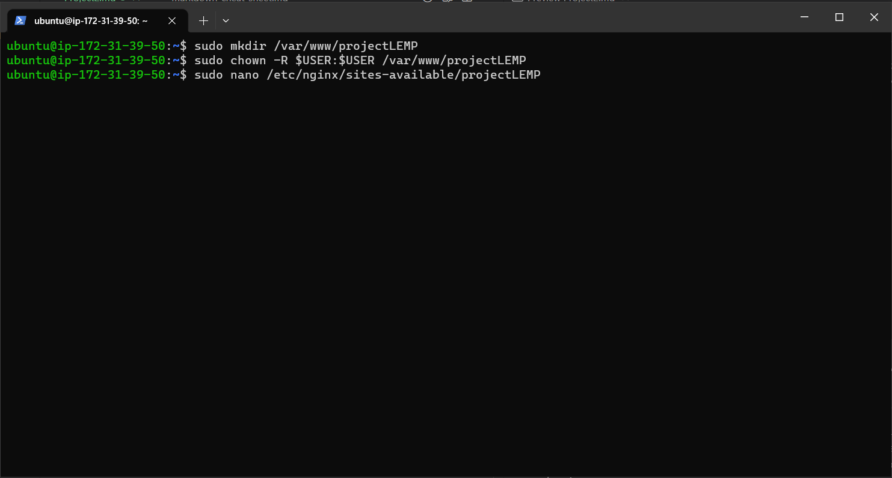

## Documentation for Project 2

# LEMP STACK IMPLEMENTATION

*connecting to AwS instance via GIT terminal*
*running the below commands*

`sudo apt update`

`sudo apt upgrade`


# STEP 1 – INSTALLING THE NGINX WEB SERVER

`sudo apt install nginx`


*to verify that NGINX was succesfully insatlled we run*

`sudo systemctl status nginx`


*Our server is running and we can access it locally and from the Internet (Source 0.0.0.0/0 means ‘from any IP address’)but let us try to check how we can access it locally in our Ubuntu shell, run*

`curl http://localhost:80`


*http://<Public-IP-Address>:80, to check it on the web browser*


# STEP 2 — INSTALLING MYSQL

*Now that you have a web server up and running, you need to install a Database Management System (DBMS) to be able to store and manage data for your site*

`sudo apt install mysql-server`


*we then log inot the console by*

`sudo mysql`


*will set a password for the root user, using mysql_native_password as default authentication method*

`ALTER USER 'root'@'localhost' IDENTIFIED WITH mysql_native_password BY 'PassWord.1';`


*Start the interactive script by running*

`sudo mysql_secure_installation`


# sudo mysql_secure_installation

*You have Nginx installed to serve your content and MySQL installed to store and manage your data. Now you can install PHP to process code and generate dynamic content for the web server*


`sudo apt install php-fpm php-mysql`


# STEP 4 — CONFIGURING NGINX TO USE PHP PROCESSOR

*When using the Nginx web server, we can create server blocks (similar to virtual hosts in Apache) to encapsulate configuration details and host more than one domain on a single server. In this guide, we will use projectLEMP as an example domain name*

*hence we create the root web directory for your_domain as follows*

`sudo mkdir /var/www/projectLEMP`

*Next, assign ownership of the directory with the $USER environment variable, which will reference your current system user*

`sudo chown -R $USER:$USER /var/www/projectLEMP`

*open the configuration using the nano editor*

`sudo nano /etc/nginx/sites-available/projectLEMP`



*Paste in the following bare-bones configuration*

```
#/etc/nginx/sites-available/projectLEMP

server {
    listen 80;
    server_name projectLEMP www.projectLEMP;
    root /var/www/projectLEMP;

    index index.html index.htm index.php;

    location / {
        try_files $uri $uri/ =404;
    }

    location ~ \.php$ {
        include snippets/fastcgi-php.conf;
        fastcgi_pass unix:/var/run/php/php8.1-fpm.sock;
     }

    location ~ /\.ht {
        deny all;
    }

}
```
*Activate your configuration by linking to the config file from Nginx’s sites-enabled directory*

`sudo ln -s /etc/nginx/sites-available/projectLEMP /etc/nginx/sites-enabled/`

*test your configuration for syntax errors by typing*

`sudo nginx -t`


*there is need to disable default Nginx host that is currently configured to listen on port 80, for this run*

`sudo unlink /etc/nginx/sites-enabled/default`

*reload Nginx to apply the changes*

`sudo systemctl reload nginx`


*Your new website is now active, but the web root /var/www/projectLEMP is still empty. Create an index.html file in that location so that we can test that your new server block works as expected*

`sudo echo 'Hello LEMP from hostname' $(curl -s http://169.254.169.254/latest/meta-data/public-hostname) 'with public IP' $(curl -s http://169.254.169.254/latest/meta-data/public-ipv4) > /var/www/projectLEMP/index.html`

*go to your browser and try to open your website URL using IP address*

*http://<Public-IP-Address>:80 or http://<Public-DNS-Name>:80*


# STEP 5 – TESTING PHP WITH NGINX

*the LAMP stack is completely installed and fully operational we can test it to validate that Nginx can correctly hand .php files off to your PHP processor by creating a test PHP file in your document root*

`sudo nano /var/www/projectLEMP/info.php`

```
<?php
phpinfo();
```


*we can now access our page vis http://`server_domain_or_IP`/info.php*


# STEP 6 – RETRIEVING DATA FROM MYSQL DATABASE WITH PHP

*We will create a database named example_database and a user named example_user, but you can replace these names with different values*

`sudo mysql`

*create a new database*

`CREATE DATABASE `example_database`;`

*create a new user and grant him full privileges on the database you have just created*

`CREATE USER 'example_user'@'%' IDENTIFIED WITH mysql_native_password BY 'Devops@1';`

*give this user permission over the example_database database*

`GRANT ALL ON example_database.* TO 'example_user'@'%';`


*test if the new user has the proper permissions by logging in to the MySQL console again, this time using the custom user credentials*

`mysql -u example_user -p`

`show databases`


*then we’ll create a test table named todo_list. From the MySQL console, run the following statement*

`CREATE TABLE example_database.todo_list (item_id INT AUTO_INCREMENT,content VARCHAR(255),PRIMARY KEY(item_id));`

*Insert a few rows of content in the test table*


*confirm that the data was successfully saved to your table, run*

`SELECT * FROM example_database.todo_list;`


*exit the mysql and create a PHP script that will connect to MySQL and query for your content*

`nano /var/www/projectLEMP/todo_list.php`


*we can now access this page in your web browser by visiting the domain name or public IP address configured for your website, followed by /todo_list.php*

*http://<Public_domain_or_IP>/todo_list.php*


